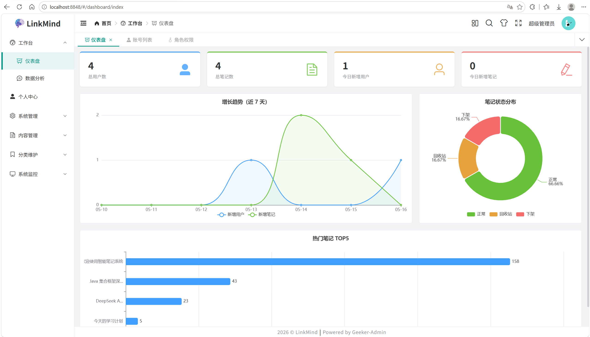
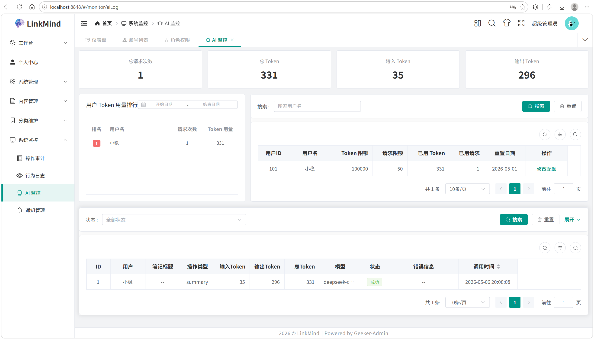
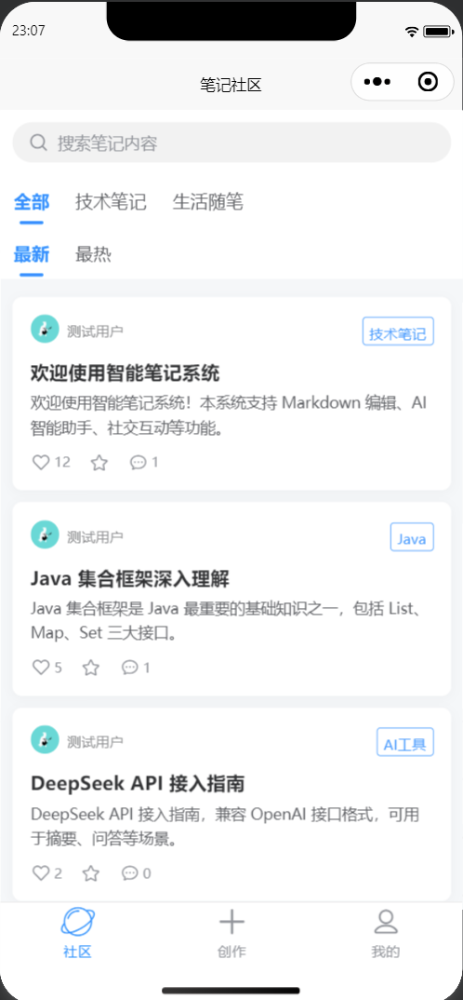
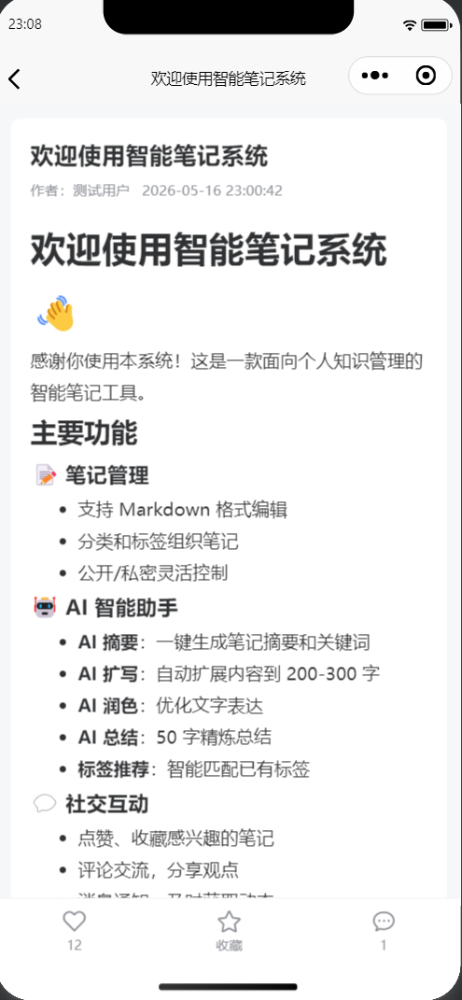

<div align="center">

# 基于 Spring Boot 的个人知识管理与智能笔记系统

[](https://spring.io/projects/spring-boot)
[](https://vuejs.org)
[](https://element-plus.org)
[](https://www.mysql.com)
[](https://redis.io)
[](https://uniapp.dcloud.net.cn)
[](./LICENSE)

</div>

## 一、项目概述

本项目是一个前后端分离的个人知识管理与智能笔记系统，面向学习记录、笔记沉淀与轻量社交互动场景。

> Web 管理端基于开源项目 [Geeker-Admin](https://github.com/HalseySpicy/Geeker-Admin) 二次开发，感谢原作者 [HalseySpicy](https://github.com/HalseySpicy)。

系统由三个核心子项目组成：

- `smart-note-system`：后端服务（Spring Boot 多模块）
- `smart-note-ui`：管理端 Web（Vue 3 + Element Plus）
- `smart-note-mp`：移动端小程序（uni-app + Vue 3，目标平台为微信小程序）

## 二、核心功能

### 📱 小程序端

| 模块 | 功能 |
|:---|:---|
| 社区 | 公开笔记浏览、分类筛选、下拉刷新、上拉加载 |
| 笔记详情 | Markdown 渲染、点赞、收藏、评论、AI 摘要生成 |
| 发布笔记 | Markdown 编辑、分类选择、标签管理、AI 扩写/润色/总结、AI 标签推荐 |
| 个人中心 | 统计数据、我的笔记/收藏/点赞、回收站、编辑个人信息 |
| 消息 | 互动消息（评论/回复/点赞/收藏）、系统通知（审核/公告），双 Tab 分组 |
| 认证 | 微信授权登录、Token 过期自动跳转、登录后返回来源页 |

### 🖥️ Web 管理端

| 模块 | 功能 |
|:---|:---|
| 工作台 | 统计卡片、增长趋势图、笔记状态分布、热门笔记排行 |
| 数据分析 | 自然语言问答，AI 生成 SQL 并返回分析结果 |
| 用户管理 | 增删改查、头像上传、角色分配、重置密码 |
| 角色管理 | 增删改查、菜单权限分配、按钮级权限控制 |
| 笔记管理 | 列表筛选（状态/审核/分类）、上架/下架、标记已审核、审核自动通知 |
| 分类管理 | 树形结构、增删改、启用/禁用 |
| 标签管理 | 列表、搜索、删除 |
| 字典管理 | 字典类型 + 字典数据增删改查 |
| 日志 | 操作审计、行为日志、时间筛选 |
| AI 监控 | Token 用量统计、用户排行、调用日志、配额管理 |
| 通知管理 | 发送系统公告（全部/指定用户） |
| 个人中心 | 修改密码、修改手机号 |

### 🔧 后端能力

| 模块 | 功能 |
|:---|:---|
| 认证 | Spring Security + JWT、Redis Token 黑名单、退出即时失效 |
| 权限 | RBAC 角色权限、菜单权限、按钮权限（v-auth 指令） |
| AI | LangChain4j + DeepSeek：摘要生成、笔记助手（扩写/润色/总结）、标签推荐、数据分析问答 |
| AI 配额 | 用户级 Token 用量追踪、月度配额管控、自动重置 |
| 消息 | 站内消息系统（8 种类型）、分组查询、未读数统计 |
| 审核 | 笔记审核标记（reviewed）、审核自动发送系统通知 |
| 缓存 | Redis 浏览量计数、定时同步 DB、Lua 脚本幂等操作 |
| 安全 | SQL 注入防护、敏感字段黑名单、接口权限校验 |
| 日志 | AOP 操作审计、行为日志上报 |

## 三、项目预览

| Web 管理端 | |
|:---:|:---:|
| 工作台 | AI 监控 |
|  |  |

| 小程序端 | |
|:---:|:---:|
| 社区首页 | 笔记详情 |
|  |  |

## 四、项目结构

```
GraduationProject
├── smart-note-system/          # 后端（Spring Boot 多模块）
│   ├── admin/                  # 启动模块
│   ├── common/                 # 通用工具
│   ├── common-log/             # 日志模块
│   ├── framework/              # 安全框架
│   ├── note/                   # 笔记业务模块
│   └── system/                 # 系统管理模块
├── smart-note-ui/              # Web 管理端（Vue 3 + pnpm）
│   ├── src/api/modules/        # API 接口定义
│   ├── src/views/              # 页面组件
│   └── src/components/         # 公共组件
├── smart-note-mp/              # 小程序端（uni-app）
│   ├── api/modules/            # API 接口
│   ├── pages/                  # 页面
│   └── components/             # 公共组件
└── docs/
    ├── sql/                    # 数据库脚本与字典
    ├── design/                 # 架构设计文档
    └── plan/                   # 开发计划与提示词
```

## 五、快速启动

### 后端

```bash
# 1. 创建数据库并导入
mysql -u root -p < docs/sql/init_all.sql

# 2. 启动 Redis（Docker）
cd smart-note-system
cp docker-compose-example.yml docker-compose.yml
# 编辑 docker-compose.yml 配置 Redis 密码等
docker-compose up -d redis

# 3. 复制配置文件
cp admin/src/main/resources/application-dev-example.yml \
   admin/src/main/resources/application-dev.yml
# 编辑 application-dev.yml 填写数据库、Redis、JWT 密钥等配置

# 4. 启动后端
mvn clean install -DskipTests
cd admin && mvn spring-boot:run
```

### Web 管理端

```bash
cd smart-note-ui
pnpm install
pnpm dev
# 访问 http://localhost:8848
```

### 小程序

```bash
# 用 HBuilderX 打开 smart-note-mp 目录
# 运行到微信小程序开发者工具
```

## 六、相关文档

- 架构设计（技术栈、模块职责、数据库概览）：[docs/design/architecture.md](docs/design/architecture.md)
- 数据库字典：[docs/sql/data_dictionary.md](docs/sql/data_dictionary.md)
- 数据库初始化脚本：[docs/sql/init_all.sql](docs/sql/init_all.sql)
- 开发计划：[docs/plan/plan.md](docs/plan/plan.md)
- 设计图（可编辑的 .drawio 源文件，含功能模块图、用例图、E-R图）：[docs/design/](docs/design/)

