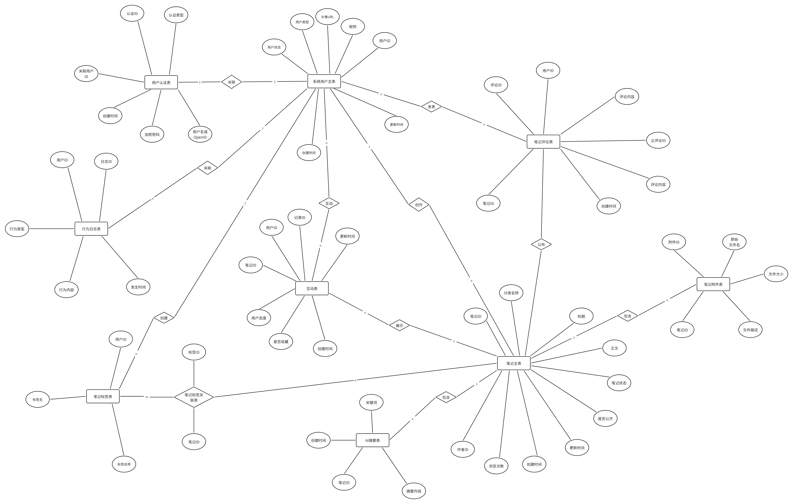

# 一、 设计概述

本系统（Smart Note）后台数据库采用关系型数据库 MySQL。

- **存储引擎**：InnoDB（支持事务处理、行级锁、外键）。
- **字符编码**：`utf8mb4`（支持完整 Unicode 字符集，包括 Emoji 表情）。
- **排序规则**：`utf8mb4_general_ci`。
- **设计原则**：采用逻辑外键设计以提高系统灵活性，所有表均包含创建与更新时间戳用于数据审计。

# 二、数据库E-R图

# 三、表清单汇总

| 模块       | 物理表名         | 中文名称       | 核心作用                           |
| ---------- | ---------------- | -------------- | ---------------------------------- |
| 用户与权限 | sys_user         | 用户主表       | 存储系统用户基础信息               |
|            | user_auth        | 用户认证表     | 存储登录凭证（密码 / 微信 OpenID） |
| 笔记业务   | note             | 笔记主表       | 存储笔记核心内容                   |
|            | note_tag         | 标签定义表     | 笔记标签库                         |
|            | note_tag_rel     | 笔记标签关联表 | 处理多对多关系                     |
|            | note_attachment  | 笔记附件表     | 存储图片与文件信息                 |
|            | note_comment     | 笔记评论表     | 用户对笔记的评论                   |
|            | note_reaction    | 笔记互动表     | 点赞 / 踩/收藏记录                 |
| 增强与日志 | note_ai_summary  | AI 摘要表      | 存储 AI 生成内容                   |
|            | sys_log_behavior | 用户行为日志表 | 记录浏览、搜索等行为               |

------

# 四、各表字段详细设计

## 1. 用户与权限模块（2张表）

### sys_user（用户主表）

| 字段名      | 类型        | 说明                 |
| ----------- | ----------- | -------------------- |
| user_id     | BIGINT (PK) | 用户ID               |
| nickname    | VARCHAR     | 昵称                 |
| avatar      | VARCHAR     | 头像URL              |
| user_type   | TINYINT     | 0 管理员，1 普通用户 |
| status      | TINYINT     | 1 正常，0 禁用       |
| create_time | DATETIME    | 创建时间             |
| update_time | DATETIME    | 更新时间             |

------

### user_auth（用户认证表）

| 字段名      | 类型        | 说明                   |
| ----------- | ----------- | ---------------------- |
| auth_id     | BIGINT (PK) | 主键                   |
| user_id     | BIGINT      | 关联用户ID             |
| auth_type   | VARCHAR     | password / wx_openid   |
| identifier  | VARCHAR     | 用户名 / OpenID        |
| credential  | VARCHAR     | 加密密码（微信可为空） |
| create_time | DATETIME    | 创建时间               |

------

## 2. 笔记业务模块（6张表）

### note（笔记主表）

| 字段名        | 类型        | 说明                     |
| ------------- | ----------- | ------------------------ |
| note_id       | BIGINT (PK) | 笔记ID                   |
| user_id       | BIGINT      | 作者ID                   |
| category_name | VARCHAR     | 分类名称                 |
| title         | VARCHAR     | 标题                     |
| content       | LONGTEXT    | Markdown 内容            |
| is_public     | TINYINT     | 0 私密，1 公开           |
| status        | TINYINT     | 0 草稿，1 正常，2 回收站 |
| view_count    | INT         | 浏览次数                 |
| create_time   | DATETIME    | 创建时间                 |
| update_time   | DATETIME    | 更新时间                 |

------

### note_tag（标签定义表）

| 字段名  | 类型        | 说明     |
| ------- | ----------- | -------- |
| tag_id  | BIGINT (PK) | 标签ID   |
| name    | VARCHAR     | 标签名称 |
| user_id | BIGINT      | 所属用户 |

------

### note_tag_rel（笔记标签关联表）

| 字段名  | 类型   | 说明               |
| ------- | ------ | ------------------ |
| note_id | BIGINT | 笔记ID             |
| tag_id  | BIGINT | 标签ID（联合主键） |

------

### note_attachment（附件表）

| 字段名    | 类型        | 说明       |
| --------- | ----------- | ---------- |
| attach_id | BIGINT (PK) | 附件ID     |
| note_id   | BIGINT      | 笔记ID     |
| file_url  | VARCHAR     | 文件路径   |
| file_name | VARCHAR     | 原始文件名 |
| file_size | BIGINT      | 文件大小   |

------

### note_comment（评论表）

| 字段名      | 类型        | 说明     |
| ----------- | ----------- | -------- |
| comment_id  | BIGINT (PK) | 评论ID   |
| note_id     | BIGINT      | 笔记ID   |
| user_id     | BIGINT      | 评论用户 |
| content     | VARCHAR     | 评论内容 |
| parent_id   | BIGINT      | 父评论ID |
| create_time | DATETIME    | 创建时间 |
| del_flag    | TINYINT     | 逻辑删除 |

------

### note_reaction（互动表）

| 字段名      |    类型     |              说明              |
| ----------- | :---------: | :----------------------------: |
| id          | BIGINT (PK) |             记录ID             |
| note_id     |   BIGINT    |             笔记ID             |
| user_id     |   BIGINT    |             用户ID             |
| attitude    |   TINYINT   | 0 无态度，1 点赞，2 踩（互斥） |
| is_favorite |   TINYINT   |       0 未收藏，1 已收藏       |
| create_time |  DATETIME   |            创建时间            |
| update_time |  DATETIME   |            更新时间            |

------

## 3. 增强与日志模块（2 张表）

### note_ai_summary（AI 摘要表）

| 字段名      | 类型        | 说明       |
| ----------- | ----------- | ---------- |
| note_id     | BIGINT (PK) | 笔记ID     |
| summary     | TEXT        | AI生成摘要 |
| keywords    | VARCHAR     | 关键词     |
| create_time | DATETIME    | 创建时间   |

------

### sys_log_behavior（行为日志表）

| 字段名 | 类型 | 说明 |
| :--- | :--- | :--- |
| id | BIGINT (PK) | 日志ID |
| user_id | BIGINT | 用户ID |
| action_type | TINYINT | 1 浏览，2 搜索 |
| content | VARCHAR | 行为内容 |
| create_time | DATETIME | 发生时间 |
